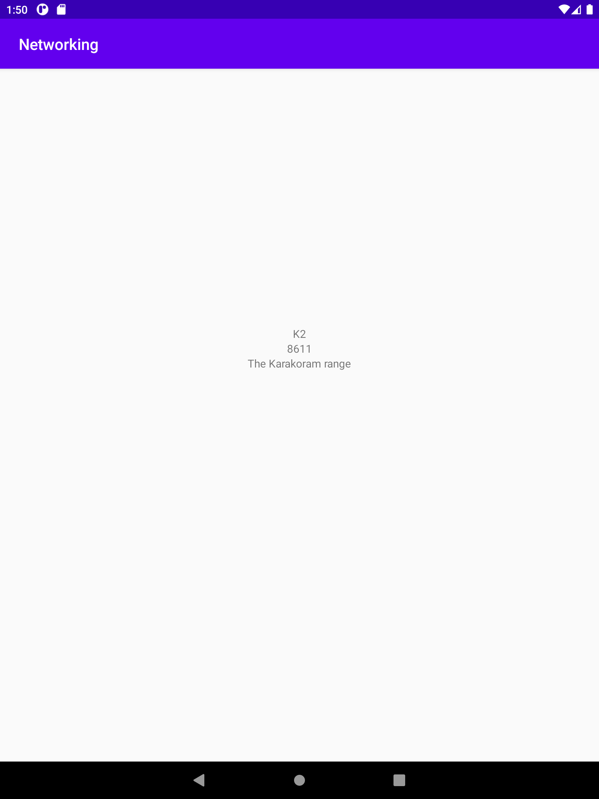
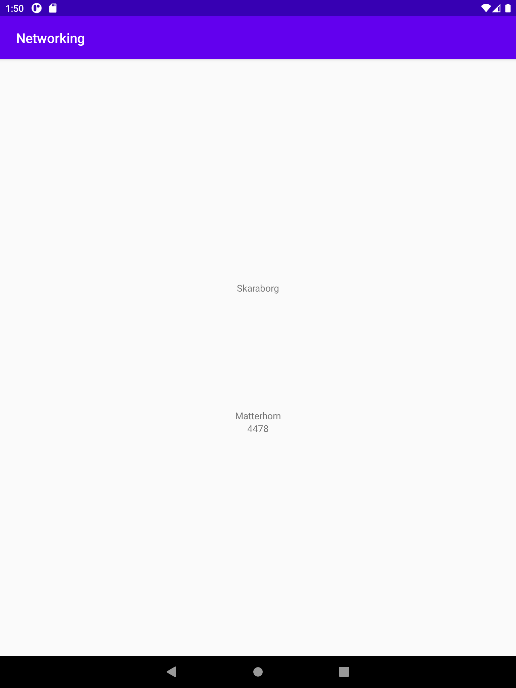

# Rapport

**Skriv din rapport här!**

-Add a RecyclerView to your layout
Jag gick in i activity_main, därefter design-vyn där jag drog in en recycler view. Sedan satte jag constraints på min recycler view.

``` 
    <androidx.recyclerview.widget.RecyclerView
        android:layout_width="wrap_content"
        android:layout_height="wrap_content"
        android:id="@+id/recyclerView"
        app:layout_constraintBottom_toBottomOf="parent"
        app:layout_constraintLeft_toLeftOf="parent"
        app:layout_constraintRight_toRightOf="parent"
        app:layout_constraintTop_toTopOf="parent" />
``` 

-Add a ArrayList<Mountain> as a member variable in your activity
Jag gjorde detta genom att skapa en "ArrayList<Mountain> Mountain;". Därefter använde jag mig av "Mountain = new ArrayList<Mountain>();" för att skapa själva Array listan.

```
    private ArrayList<Mountain> Mountain;
    Mountain = new ArrayList<Mountain>();
``` 

-Add a RecyclerView.Adapter as a member variable in your activity
Detta gjordes genom att skapa en "MyAdapter" som namngavs till recyclerAdapter.
``` 
    private MyAdapter recyclerAdapter;
```

-Create a RecyclerView.Adapter and a RecyclerView.ViewHolder
I förstahand skapade jag två java klasser. Därefter Började jag med adaptern som innehåller två variabler. Dessa variabler är en "List" samt "MyAdapter".
Sedan skapades en onCreateViewHolder samt en onBindViewHolder. I min onCreateViewHolder skapades en View där jag sätter in XML datan som finns. Därefter
returneras view. Sedan började jag på min onBindViewHolder. Denna används för att hämta data från "Mountain" javafilen. Denna javafil innehåller sedan getters 
och setters för de objekt som ska visas.

```
public class MyAdapter extends RecyclerView.Adapter<ViewHolder> {
    private List<Mountain> Mountain;
    public MyAdapter(ArrayList<Mountain> Mountain) {
        this.Mountain = Mountain;
    }

    @NonNull
    @Override
    public ViewHolder onCreateViewHolder(@NonNull ViewGroup parent, int viewType) {
        View view = LayoutInflater.from(parent.getContext()).inflate(R.layout.activity_second, parent, false);
        return new ViewHolder(view);
    }

    @Override
    public void onBindViewHolder(@NonNull ViewHolder holder, int position) {
        holder.name.setText(Mountain.get(position).getName());
        holder.location.setText(Mountain.get(position).getLocation());
        holder.size.setText(String.valueOf(Mountain.get(position).getSize()));
    }
}
``` 

-Use getJson() to download your json data by changing the JSON_URL and write code in onPostExecute().
I detta fall använde jag mig av en annan lösning. Denna lösning innefattar användandet av gson. I förstahand skapar jag en ny Gson variabel samt en Type variabel.
Därefter sätter jag att "ArrayList<Mountain>" är = gson.fromJson. Detta används för att hämta datan från Json dokumentet. Sedan lägger jag till alla data i
min Array genom att använda "addAll". Sist uppdaterar jag datan i min adapter med hjälp av "notifyDataSetChanged()".

```
    public void onPostExecute(String json) {
        Gson gson = new Gson();
        Type type = new TypeToken<ArrayList<Mountain>>() {}.getType();
        ArrayList<Mountain> array = gson.fromJson(json, type);
        Mountain.addAll(array);
        recyclerAdapter.notifyDataSetChanged();
    }
``` 




